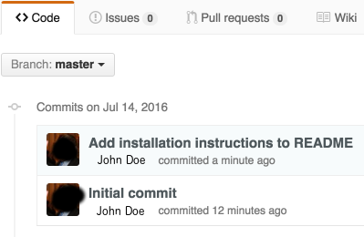

# GitHub Enterprise SSO ID to Name

## Installation

Installation should happen from the Chrome App Store.  

## Configuration

Initial configuration is required for use.  After enabling the extension, you should see an "Option" menu item when you click on the extension icon, or if you go to the [Extensions Page](chrome://extensions) you should see a "Options" link under the description of the extension.

You will need to add the url to be matched (using indexOf [this may change in a future version]), as well as the url to your Github API Root.

## About

This is a Chrome extension that replaces a users Enterprise ID with their name in GitHub Enterprise. Link content and functionality is not affected. There's a _tiny_ chance that it could visually replace a 6 digit number in code somewhere, but the change would only be visual in the browser, but the odds of that happening are pretty low (and it would have to coincidentally equate to an actual, valid, SSOID to be changed).

#### Before

#### After

#### Todo

* Better ID detection
* Replacement of IDs on mouseover

## License
This is shared under the GPL V3 License.  Logo is used from Wikipedia under CC-SA 3.0 License.
